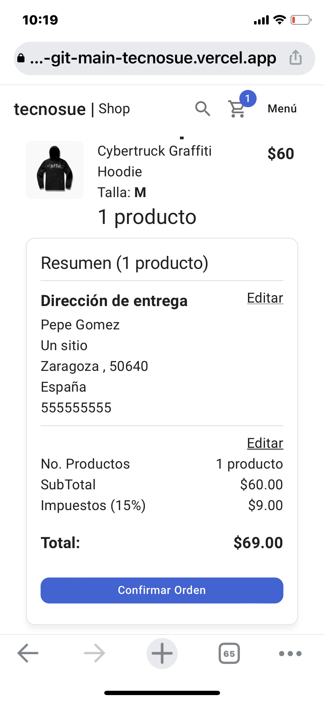
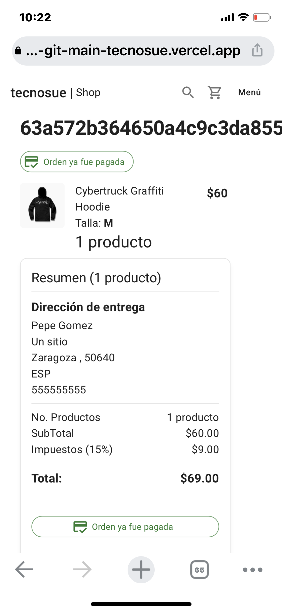
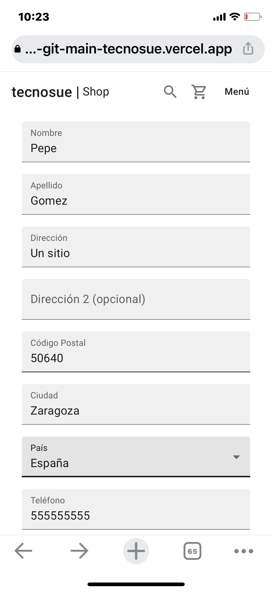
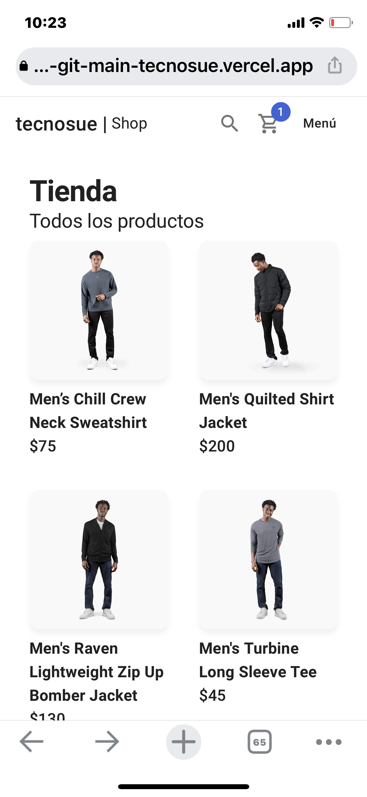
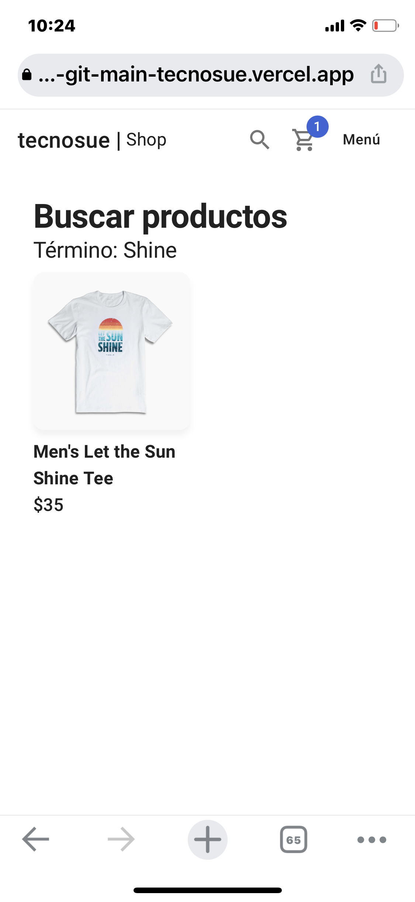
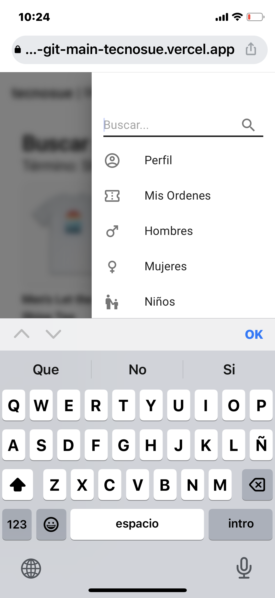

# `<Tecnosue Shop>`

## Descripcion

Tienda online de ropa en la que podemos seleccionar productos, añadirlos a nuestro carrito de compra, modificar el carrito y confirmarlo.

Para guardar la orden necesitaremos estar autenticados.
Podemos registrarnos en la base de datos o con GitHub.
Implementado Paypal (Sandbox) como modo de pago.

Totalmente responsive.

## Lenguajes y Tecnologías:

NextJS, React, Typescript, Docker, MongoDb, Fetch / Axios

## Instalación:

Para correr localmente, se necesita la base de datos.

```
docker-compose up -d
```

### Configurar las variables de entorno

Renombrar el archivo __.env.template__ a __.env__

* MongoDB URL Local:

```
MONGO_URL=mongodb://localhost:27017/tecnosuedb
```

* Reconstruir los módulos de node y levantar Next

```
yarn install
yarn dev
```

## Llenar la base de datos con información de pruebas

Llamar a:

```
http://localhost:3000/api/seed
```

## Capturas

    md
    md
    md
    md
    md
    md

## licencia

## Alojado en VERCEL:

[Tecnosue Shop](https://tecnosue-shop-bottega-capstone-tecnosue.vercel.app)
